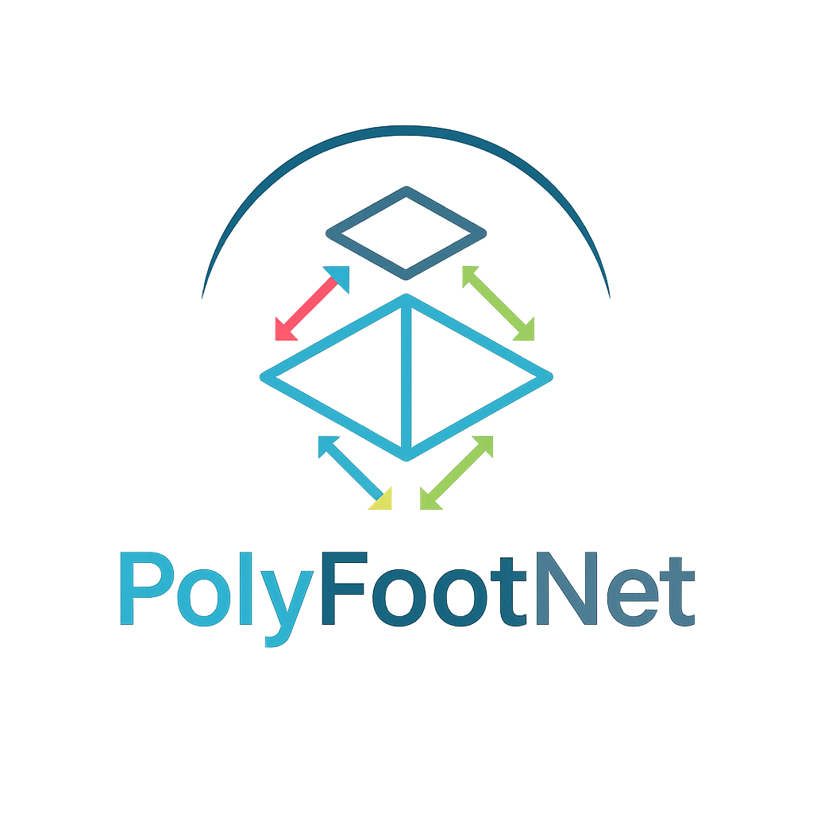

# PolyFootNet
For preprint paper PolyFootNet. The README is on doing....

<!--
*** Thanks for checking out the Best-README-Template. If you have a suggestion
*** that would make this better, please fork the repo and create a pull request
*** or simply open an issue with the tag "enhancement".
*** Don't forget to give the project a star!
*** Thanks again! Now go create something AMAZING! :D
-->

<!-- PROJECT SHIELDS -->
<!--
*** I'm using markdown "reference style" links for readability.
*** Reference links are enclosed in brackets [ ] instead of parentheses ( ).
*** See the bottom of this document for the declaration of the reference variables
*** for contributors-url, forks-url, etc. This is an optional, concise syntax you may use.
*** https://www.markdownguide.org/basic-syntax/#reference-style-links
-->
<!-- [![Contributors][contributors-shield]][contributors-url] -->

[![MIT License][license-shield]][license-url]

<!-- PROJECT LOGO -->
 

  

  <h3 align="center">PolyFootNet: Extracting Polygonal Building
Footprints in Off-Nadir Remote Sensing Images</h3>

  

    Extract polygonal building footprints and explore the multiple extraction solutions.
  

## 1. Paper Contributions
1. Proposed the first polygonal building footprint extraction network for the off-nadir scenery. 
2. Explored the multiple solutions to Building Footprint Extraction (BFE) problems. 
3. Designed a mathematical but interpretable module, Self Offset Attention (SOFA), to improve offset predictions. 
4. Our method exhibits SOTA performance on three datasets. 

<!-- [![Product Name Screen Shot][product-screenshot]](https://example.com) -->
| ![Product Name Screen Shot][PolyFootNet-screenshot] | ![Product Name Screen Shot][SOFA-screenshot] |
| :---: | :---: |
| (a) PolyFootNet| (b) SOFA |

## 2. Architectural Insights & Design Rationale
The figures illustrate the structure of PolyFootNet and SOFA. 
### 2.1 How we degsin the SOFA?

<!-- MARKDOWN LINKS & IMAGES -->
<!-- https://www.markdownguide.org/basic-syntax/#reference-style-links -->
[contributors-shield]: https://img.shields.io/github/contributors/othneildrew/Best-README-Template.svg?style=for-the-badge
[contributors-url]: https://github.com/
[forks-shield]: https://img.shields.io/github/forks/othneildrew/Best-README-Template.svg?style=for-the-badge
[forks-url]: https://github.com/network/members
[stars-shield]: https://img.shields.io/github/stars/othneildrew/Best-README-Template.svg?style=for-the-badge
[stars-url]: https://github.com/stargazers
[issues-shield]: https://img.shields.io/github/issues/othneildrew/Best-README-Template.svg?style=for-the-badge
[issues-url]: https://github.com/issues
[license-shield]: https://img.shields.io/github/license/othneildrew/Best-README-Template.svg?style=for-the-badge
[license-url]: LICENSE
[PolyFootNet-screenshot]: icons/PolyFootNet.png
[SOFA-screenshot]: icons/SOFA.png
[Next.js]: https://img.shields.io/badge/next.js-000000?style=for-the-badge&logo=nextdotjs&logoColor=white
[Next-url]: https://nextjs.org/
[React.js]: https://img.shields.io/badge/React-20232A?style=for-the-badge&logo=react&logoColor=61DAFB
[React-url]: https://reactjs.org/
[Vue.js]: https://img.shields.io/badge/Vue.js-35495E?style=for-the-badge&logo=vuedotjs&logoColor=4FC08D
[Vue-url]: https://vuejs.org/
[Angular.io]: https://img.shields.io/badge/Angular-DD0031?style=for-the-badge&logo=angular&logoColor=white
[Angular-url]: https://angular.io/
[Svelte.dev]: https://img.shields.io/badge/Svelte-4A4A55?style=for-the-badge&logo=svelte&logoColor=FF3E00
[Svelte-url]: https://svelte.dev/
[Laravel.com]: https://img.shields.io/badge/Laravel-FF2D20?style=for-the-badge&logo=laravel&logoColor=white
[Laravel-url]: https://laravel.com
[Bootstrap.com]: https://img.shields.io/badge/Bootstrap-563D7C?style=for-the-badge&logo=bootstrap&logoColor=white
[Bootstrap-url]: https://getbootstrap.com
[JQuery.com]: https://img.shields.io/badge/jQuery-0769AD?style=for-the-badge&logo=jquery&logoColor=white
[JQuery-url]: https://jquery.com 

[Huizhou]: https://portland-my.sharepoint.com/:f:/g/personal/kaili37-c_my_cityu_edu_hk/Ep2EnO01ZghPuebKASl5h60BUjbBvrbiSHKoSiwfIBYBNg?e=7hdlzQ

[OBMweight]: https://1drv.ms/u/c/4714078bb90d0216/EbVLDOlRwlZHr5h60nC3HuoBk1QrRFc6QqY_oXPCz-_3nA?e=Xbe1Qc
[pytorch.org]: https://pytorch.org
[MMDetection.git]: https://github.com/open-mmlab/mmdetection
[pytorch]: https://pytorch.org
[MMDetection]: https://github.com/open-mmlab/mmdetection
[BONAI.git]: https://github.com/jwwangchn/BONAI
[BONAI]: https://github.com/jwwangchn/BONAI
[SAM]: https://github.com/facebookresearch/segment-anything
