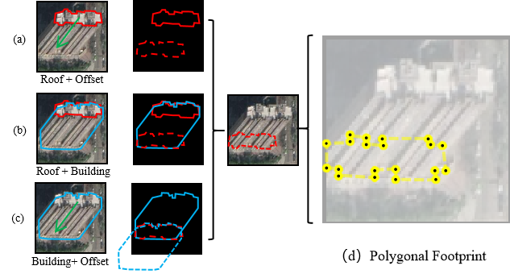

# PolyFootNet
For preprint paper PolyFootNet. 
<a name="readme-top"></a>
<!--
*** Thanks for checking out the Best-README-Template. If you have a suggestion
*** that would make this better, please fork the repo and create a pull request
*** or simply open an issue with the tag "enhancement".
*** Don't forget to give the project a star!
*** Thanks again! Now go create something AMAZING! :D
-->


<!-- PROJECT SHIELDS -->
<!--
*** I'm using markdown "reference style" links for readability.
*** Reference links are enclosed in brackets [ ] instead of parentheses ( ).
*** See the bottom of this document for the declaration of the reference variables
*** for contributors-url, forks-url, etc. This is an optional, concise syntax you may use.
*** https://www.markdownguide.org/basic-syntax/#reference-style-links
-->
<!-- [![Contributors][contributors-shield]][contributors-url] -->

[![MIT License][license-shield]][license-url]


<!-- PROJECT LOGO -->
<br />
<div align="center">
  <a href="https://github.com">
    
  </a>

  <h3 align="center">PolyFootNet: Extracting Polygonal Building
Footprints in Off-Nadir Remote Sensing Images</h3>

  <p align="center">
    Extract polygonal building footprints and explore the multiple extraction solutions.
  </p>
</div>

## 1. Paper Contributions
1. Proposed the first polygonal building footprint extraction (BFE) network for the off-nadir scenery. 
2. Explored the multiple solutions to Building Footprint Extraction (BFE) problems. 
3. Designed a mathematical but interpretable module, Self Offset Attention (SOFA), to improve offset predictions. 
4. Our method exhibits SOTA performance on three datasets. 

<!-- [![Product Name Screen Shot][product-screenshot]](https://example.com) -->
| ![Product Name Screen Shot][PolyFootNet-screenshot] | ![Product Name Screen Shot][SOFA-screenshot] |
| :---: | :---: |
| (a) PolyFootNet| (b) SOFA |

## 2. Architectural Insights & Design Rationale
The figures illustrate the structure of PolyFootNet and SOFA. 

### 2.1 Design Motivation of the Self‑Offset Attention (SOFA) Module

The conception of **SOFA** is driven by two complementary observations:

1. **Attention as learnable pooling**  
   *Dr. Mu Li* formalises attention layers as kernel‑based pooling—essentially a data‑adaptive weighted average grounded in Nadaraya–Watson regression.  
   This interpretation frames attention not as a novel operator, but as a principled pooling mechanism.

2. **Empirical behaviour in BFE tasks**  
   In Building Footprint Extraction (BFE) models, roof‑to‑footprint offsets for **taller buildings** (i.e. longer vectors) consistently exhibit lower angular error than those for **shorter buildings** in the same image.
   
SOFA leverages these insights to let *reliable long offsets* refine *less‑reliable short offsets*. (or say: pooling knowledges from longer offsets or concentrate more on them)

---

#### Further Reading

| Resource | Link |
|----------|------|
| *Attention Pooling* (English, D2L) | <https://d2l.ai/chapter_attention-mechanisms-and-transformers/attention-pooling.html> |
| *注意力池化* (中文, D2L) | <https://zh.d2l.ai/chapter_attention-mechanisms/nadaraya-waston.html> |
| Lecture video (YouTube) | <https://www.youtube.com/watch?v=EUFhCYuD3gk> |
| Lecture video (Bilibili) | <https://www.bilibili.com/video/BV1264y1i7R1> |


### 2.2 Why Explore Multiple Formulations (“Multi‑Solutions”) of the BFE Task?
<div align="center">
  
</div>
In this figure, (a) is a commonly used solution for BFE. (b) and (c) is that we studied new cases, and (d) is what PolyFootNet can do. 
Two complementary considerations motivate our investigation.

1. **Empirical evidence from pilot studies**  
   Preliminary experiments contrasted masks for **entire buildings** versus **partial‑roof regions**. Intersection‑over‑Union (IoU) scores were consistently *higher* for full‑building masks. Visual inspection suggests that models struggle to distinguish the roof–facade seam, whereas the building–ground boundary is far more salient. This observation encouraged us to search for *alternative factorizations*—representations that bypass the ambiguous roof edge yet still recover precise footprints.

2. **Heterogeneous labelling conventions across public datasets**  
   A decade of BFE research has produced multiple benchmarks with dissimilar annotations. For example, **BANDON** supplies only roof and facade polygons, omitting footprints altogether. By developing mathematically consistent “multi‑solution” formulations, we can **project heterogeneous labels into a common space**, thereby  
   * unlocking legacy datasets that would otherwise be unusable,  
   * constructing unified training pipelines, and  
   * improving robustness and generalisation through greater data diversity.

In short, studying multi‑solutions provides both a pragmatic route to higher accuracy and a unifying framework for disparate remote‑sensing datasets.

## 3. Installation
Please follow the instructions of [OBM](https://github.com/likaiucas/OBM) and [BONAI](https://github.com/jwwangchn/BONAI). 

## 4. To Use

## 5. Citing
```
@ARTICLE{li2023obm,
  author={Li, Kai and Deng, Yupeng and Kong, Yunlong and Liu, Diyou and Chen, Jingbo and Meng, Yu and Ma, Junxian and Wang, Chenhao},
  journal={IEEE Transactions on Geoscience and Remote Sensing}, 
  title={Prompt-Driven Building Footprint Extraction in Aerial Images With Offset-Building Model}, 
  year={2024},
  volume={62},
  number={},
  pages={1-15},
  keywords={Buildings;Prediction algorithms;Production;Data models;Data mining;Remote sensing;Instance segmentation;Feature extraction;Training;Three-dimensional displays;Building footprint extraction (BFE);nonmaximum suppression (NMS);roof segmentation;roof-to-footprint offset extraction;segment anything model (SAM)},
  doi={10.1109/TGRS.2024.3487652}}
```

```
@article{li2024polyfootnet,
  title={Extracting polygonal footprints in off-nadir images with Segment Anything Model},
  author={Li, Kai and Deng, Yupeng and Chen, Jingbo and Meng, Yu and Xi, Zhihao and Ma, Junxian and Wang, Chenhao and Zhao, Xiangyu},
  journal={arXiv preprint arXiv:2408.08645},
  year={2024}
}
```

<!-- MARKDOWN LINKS & IMAGES -->
<!-- https://www.markdownguide.org/basic-syntax/#reference-style-links -->
[contributors-shield]: https://img.shields.io/github/contributors/othneildrew/Best-README-Template.svg?style=for-the-badge
[contributors-url]: https://github.com/
[forks-shield]: https://img.shields.io/github/forks/othneildrew/Best-README-Template.svg?style=for-the-badge
[forks-url]: https://github.com/network/members
[stars-shield]: https://img.shields.io/github/stars/othneildrew/Best-README-Template.svg?style=for-the-badge
[stars-url]: https://github.com/stargazers
[issues-shield]: https://img.shields.io/github/issues/othneildrew/Best-README-Template.svg?style=for-the-badge
[issues-url]: https://github.com/issues
[license-shield]: https://img.shields.io/github/license/othneildrew/Best-README-Template.svg?style=for-the-badge
[license-url]: LICENSE
[PolyFootNet-screenshot]: icons/PolyFootNet.png
[SOFA-screenshot]: icons/SOFA.png
[Next.js]: https://img.shields.io/badge/next.js-000000?style=for-the-badge&logo=nextdotjs&logoColor=white
[Next-url]: https://nextjs.org/
[React.js]: https://img.shields.io/badge/React-20232A?style=for-the-badge&logo=react&logoColor=61DAFB
[React-url]: https://reactjs.org/
[Vue.js]: https://img.shields.io/badge/Vue.js-35495E?style=for-the-badge&logo=vuedotjs&logoColor=4FC08D
[Vue-url]: https://vuejs.org/
[Angular.io]: https://img.shields.io/badge/Angular-DD0031?style=for-the-badge&logo=angular&logoColor=white
[Angular-url]: https://angular.io/
[Svelte.dev]: https://img.shields.io/badge/Svelte-4A4A55?style=for-the-badge&logo=svelte&logoColor=FF3E00
[Svelte-url]: https://svelte.dev/
[Laravel.com]: https://img.shields.io/badge/Laravel-FF2D20?style=for-the-badge&logo=laravel&logoColor=white
[Laravel-url]: https://laravel.com
[Bootstrap.com]: https://img.shields.io/badge/Bootstrap-563D7C?style=for-the-badge&logo=bootstrap&logoColor=white
[Bootstrap-url]: https://getbootstrap.com
[JQuery.com]: https://img.shields.io/badge/jQuery-0769AD?style=for-the-badge&logo=jquery&logoColor=white
[JQuery-url]: https://jquery.com 

[Huizhou]: https://portland-my.sharepoint.com/:f:/g/personal/kaili37-c_my_cityu_edu_hk/Ep2EnO01ZghPuebKASl5h60BUjbBvrbiSHKoSiwfIBYBNg?e=7hdlzQ

[OBMweight]: https://1drv.ms/u/c/4714078bb90d0216/EbVLDOlRwlZHr5h60nC3HuoBk1QrRFc6QqY_oXPCz-_3nA?e=Xbe1Qc
[pytorch.org]: https://pytorch.org
[MMDetection.git]: https://github.com/open-mmlab/mmdetection
[pytorch]: https://pytorch.org
[MMDetection]: https://github.com/open-mmlab/mmdetection
[BONAI.git]: https://github.com/jwwangchn/BONAI
[BONAI]: https://github.com/jwwangchn/BONAI
[SAM]: https://github.com/facebookresearch/segment-anything
